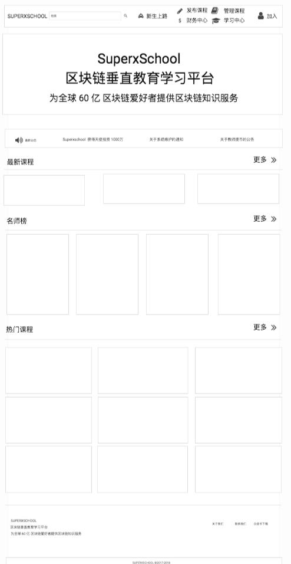

#  SueprxschoolWhitePaper Introduction

* [一、通证激励 TOKEN INCENTIVE](TOKEN.md)
* [二、产品打造 PRODUCT BUILDING](PRODUCT.md)
* [三、技术结构 TECHNICAL STRUCTURE](TECHNICAL.md)
* [四、团队构成 TEAM COMPOSITION](TEAM.md)
* [五、盈利模式 PROFIT MODEL](PROFIT.md)

# 一、TOKEN 激励分配

（一）发行总量

SXST 的发放的总数量为：100亿 SXST；

（二）代币分配

(1)运营维护团队：

- 20 亿 SXST；

其中 20 亿 用来成立超级基金，完成后续优质项目的孵化；

(2)超级基金团队

- 30 亿 SXST；

其中 30 亿 用来完成后续团队的奖励；

(3)用户奖励机制；

- 40亿 SXST；

其中 40 亿 用来完成用户的奖励和激励；

(4)机构私募

- 10亿 SXST；

其中 10 亿 用来完成机构的私募；

分为 天使轮 、A 、B 轮完成机构私募；
- 天使轮：1 亿 SXST； 融资 1000 万，完成团队化的运作；
- A 轮： 3 亿 SXST； 融资  1.5 亿，完成产品化的迭代；
- B 轮： 6 亿 SXST； 融资   5  亿，完成全球化的扩张；

# 二、产品打造 PRODUCT BUILDING

我们的 SUPERXSCHOOL 需要完成网页端的产品和移动端的产品。

在教育学习的场景里面，主要包括线上通关学习，线上产品提交激励，下线活动参与激励的过程中，完成 TOKEN 的奖励；

## 对于学习知识体系的获得，主要包括：
- （1）知识体系的输入
- （2）知识体系的沟通
- （3）知识体系的输出。

判断一个人的知识体系

- （1）判断一个个体是否真正的掌握知识的核心点在于是不是可以依据已有的知识体系，完成知识的重新组装。
- （2）判断一个人是不是真正的掌握知识的核心要点，在于这个人是不是完成知识的的教学。
- （3）判断一个人是不是真正的掌握知识的核心要点，在于这个人是不是基于已有的内容体系，在不断的解决问题和发现问题的过程中，完成全新知识体系的梳理。。

## 我们的产品的主要的思路和结构：
### （一）学习通关
- （1）用户进入网站学习后，通关完成 100-1000 TOKEN 奖励；

### （二）经验提交
- （2）用户提交有价值的内容，完成 100-10000 TOKEN 奖励；
- （3）用户评论发布， 获得 1-10 TOKEN 奖励；
- （4）用户评论被精选，获得 1 0-100 TOKEN 奖励；

### （三）线下交流：
- （5）用户组织线下活动，获得 100-1000 TOKEN 奖励；
- （6）用户参与线下活动，获得 1-100 TOKEN 奖励；

### （四）团队参赛：
- （5）参加线上比赛，获得 100-1000 TOKEN 奖励；
- （6）参加线下比赛，获得 1000-10000 TOKEN 奖励；

## 产品上线时间表

- 2018年7月 上线 SueprxSchool 网页端内测；
- 2018年9月 上线 SueprxSchool 安卓端应用；
- 2018年11月 上线 SueprxSchool 苹果端应用；

# 三、技术结构 TECHNICAL STRUCTURE
# 四、团队构成 TEAM COMPOSITION

# 创始人：肖威
全栈工程师 EOS的定投践行者 COINXP早期参与者 区块链实用教育发起人
区块链黑客马拉松冠军选手

先后研发如下产品：
- 2010-2014年：
学习，大学期间从事在线教育工作，基于各大在线教育平台，完成职业技能网课的制作；

- 2014-2016年：
就业，在从事传统教育的过程中，不断的开始在线教育的尝试，曾在某平台组织职业类微课程，组织筹办 50+ 在线职业分享课程，收获付费用户 4000 + 人；

- 2016-2018年：
创业，开始自学 Ruby on Rails网站开发 ，逐步完成传统教育工作者向互联网教育工作者转型，在不断的通过各类区块链学习和授课的过程中，从传统互联网教育从业者向区块链教育布道者进阶。

SUPERXSCHOOL 技术团队成为来自于亚马逊、联想等领域。团队迅速发展为20余人，在国内区块链领域，是一直实力较强的技术团队。

# 五、盈利模式 PROFIT MODEL
